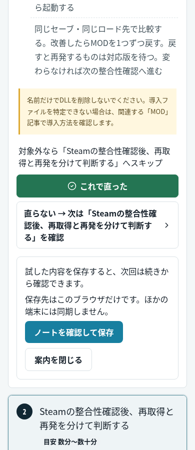

# 結果から解決ノート・再訪への導線（2026-10-05）

基点: `gemunao` / PR #56 / `6dfbfa5002f7cbe7135439de58a001473dc4c459`。
`AGENTS.md` と `CLAUDE.md` を確認。リポジトリ内に `.agents/skills` はなく、環境の `/workspace/.agents` も空だった。

## 変更

1. ワイルズ起動不良記事の早見表を、起動直後・狩猟中・シェーダー準備・更新後の順で始める。日本語と実在する英語版を変更し、既存4言語テンプレートで対象外の手順を飛ばせることを明示。STEP ID・URL・記事タイトルは維持。
2. 既存の結果ボタンからノートへの自動追記を、閉じられる任意の案内に置換。既存 `SolutionForm` を再利用し、新規／既存ノートの保存先と内容を確認して保存する。キャンセル・閉じる・結果押下だけではノート／記事進行キーを書き込まない。匿名回答APIの既存処理と二重回答防止は維持。
3. 未解決ボタンに次のSTEP名を表示。対象外スキップは試行履歴を作らない。解決後は次の確認を促さず、明示保存した解決済みノートも再読込時に反映する。
4. 日本語・英語・中国語・スペイン語トップで、未解決ノートの続きと既存の確認済み更新欄を一般的な再訪導線より先に表示。保存した次STEPのリンクと記事内の「前回の続き」を接続。初回／全件解決／削除後には個人向け欄を表示しない。更新がないときは解決済みと誤認させない既存文言を使う。

ノート保存形式、MyGames上限、診断CTA、SEO・広告・D1スキーマ・Botは変更していない。旧記事進行データは読み取り可能なまま。新しい進行状況は明示保存したノートを優先する。

## 検証

- `pnpm exec tsc --noEmit`、`pnpm lint`、`pnpm build`、`pnpm check:localized`（79ページ）。
- `run-saved-solutions-check`、`run-support-check`、`check-support-empty-states`、`run-home-return-paths-check`、`run-my-games-page-check`、`run-my-games-analytics-check`。
- `check-feedback-input`、`check-feedback-d1`（ローカルMiniflareだけ）、`check-editorial-safety`、`check-english-articles`、`check-article-diagnosis`。
- `check-home-return-build`: 日本語・英語・中国語・スペイン語トップのheadと、参照CSS/JS 32件の200応答。
- `check-static-pages-http`: ローカルPagesで285記事、HEAD/query/RSC/non-GETの分離、robots/ads/sitemap、診断ZIP 3本の同一性。D1 bindingなし。
- `check-support-browser`: 既存ノート作成・再読込・記事間移動・戻る／進む・復元・共有文のプレビュー・quotaエラー・4言語UI。
- `check-notebook-target-browser`: `/my` と4言語 `/my-games` の375/1440px、空状態・保存・再読込・キーボードからの作成。
- `check-support-isolation`: 完成ビルドをローカル配信し、Chromiumの375/390/430/1440pxで早見表順序、対象外スキップ、結果押下、案内開閉、キャンセル／保存、A/Bノートの分離、再訪・戻る／進む・再読込、解決後、4言語トップの初回／未解決／全件解決／削除後、横はみ出しを検証。

ブラウザ検証はすべて新規コンテキストのローカルfixture。APIと外部通信は遮断またはfixture応答に差し替え、ノートの識別文字列がリクエストに混入しないことも確認した。確認済み更新の登録配列は空のまま。更新あり・対象外の分岐はテスト内だけの合成データで検証している。

## 実画面

## 制限・計測

実機Windowsでゲームの症状を再現した検証、実ユーザー試験、本番公開後の確認はしていない。ローカルUI検証はChromiumのみ。Cloudflareのブラウザログイン／CAPTCHAは使用していない。

新しい案内表示・ノート保存・再訪導線専用のGAイベントは追加しておらず未計測。既存の匿名結果イベントは維持するが、ノート本文・ID・タイトルなどをGAへ送信しない。PV効果・解決率改善は評価していない。

マージ・本番公開は確認待ち。
