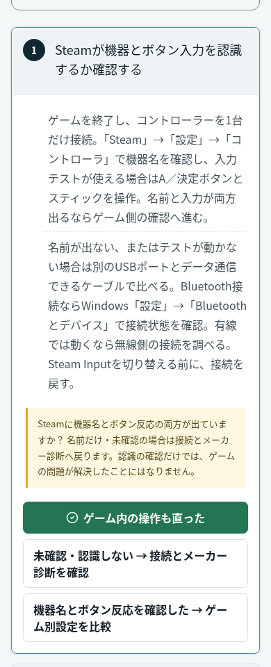

# 保護機能の案内とSteam Inputの前提分岐

基点: `gemunao` / PR #57 merge `1d5cc67b060c24c92261dccaa6b57253f655d1eb`。
`AGENTS.md` と `CLAUDE.md` を確認。リポジトリに `.agents/skills` はなく、環境の `.agents` も空だった。

## 変更

- Cyberpunk 2077起動不良の `verify-files` で、日本語・中国語・スペイン語に残っていたセキュリティソフト停止／例外追加の案内を置換。非必須オーバーレイだけを1つずつ比較し、ウイルス対策・ファイアウォールを有効に保つ。起動のための検疫解除／除外追加をしない。誤検知の疑いは製品の公式窓口かCD PROJEKT REDへ確認する。安全側に修正済みの英語本文は保持し、4言語の回帰を追加した。
- Steam Input STEP 1だけに記事固有の `advanceCheck` を追加。未確認／未認識は既存の `#input-device` の接続・メーカー診断へ。機器名とボタン反応の両方を確認した場合だけSTEP 2のゲーム別比較へ進む。
- 前提確認の2リンクは移動と問題ごとの一時UI状態だけを変える。解決票、試行済みマーク、ノートの自動保存は行わない。実際にゲーム内の操作が直った報告は別ボタン。STEP 2以降の結果操作は確認前には前提確認へ戻す案内になる。
- 確認状態は記事・問題・保存版ごとに分離。保存ノート／旧進捗だけでは機器の認識を確認済みと判断しない。未解決ノートを再読込した場合はSTEP 1から確認し直す。解決済みノートは再作業を促さない。
- その他の記事には分岐メタデータを追加せず、従来の次へ・対象外スキップを維持。URL・STEP ID・記事タイトル・保存形式・匿名投票の重複防止・D1・SEO・AdSense・Botは変更しない。

## 検証

- 型: `pnpm exec tsc --noEmit`
- `pnpm lint` / `pnpm build` / `pnpm check:localized`（79ページ）
- 本文更新を参照する日本語Cyberpunkの共有画像1枚を `pnpm og:cards` で再生成し、manifestと一緒に更新（記事タイトル・画像URLは維持）。
- 新規 `check-safe-step-navigation.mjs`: 4言語の保護維持・1つずつの比較・検疫／除外の注意・公式窓口、旧危険文の不在、STEP ID保持、Steam Input STEP 1以外に前提分岐がないこと。
- 新規 `check-safe-step-navigation-browser.mjs`: 完成ビルドの375/390/430/1440px。キーボードによる両分岐、接続案内への移動、確認前の次STEP抑止、認識確認の投票／保存ゼロ、旧解決済み進捗＋未解決ノート、A→B→Aの前提確認分離、取消／保存／再読込、ゲーム結果だけの匿名POSTと重複防止、4言語Cyberpunkの表示と横はみ出しを確認。
- 既存ブラウザ検査: `check-support-case-switch-browser` / `check-support-isolation` / `check-support-browser` / `check-notebook-target-browser`。
- 既存回帰: saved-solutions / support / support-empty-states / home-return-paths / my-games-page / my-games-analytics / feedback-input / feedback-d1 / editorial-safety / english-articles / article-diagnosis。
- `check-static-pages-http`: ローカル285ページ、HEAD/query/RSC/non-GET分離、robots/ads/sitemap、診断ZIP 3本の同一性。D1 bindingなし。
- `check-home-return-build`: 4言語トップのheadと参照CSS/JS 32件の200応答。

すべて新規ブラウザコンテキストのローカルfixture。外部通信／アンケートAPIは遮断または合成応答で、実ユーザー記録と本番D1には触れていない。実機コントローラー・ゲームの検証や本番公開後検証は未実施。UI検証はChromiumのみ。前提確認専用の分析イベントは追加せず未計測。PVや解決率の効果は主張しない。

Cloudflareブラウザログイン／CAPTCHAは使用していない。Botは保留のまま。マージ・本番公開は確認待ち。

## 公開前の実画面

